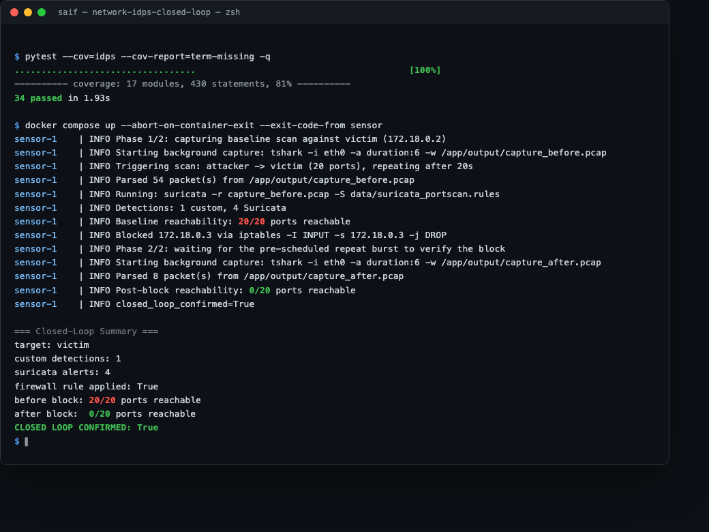
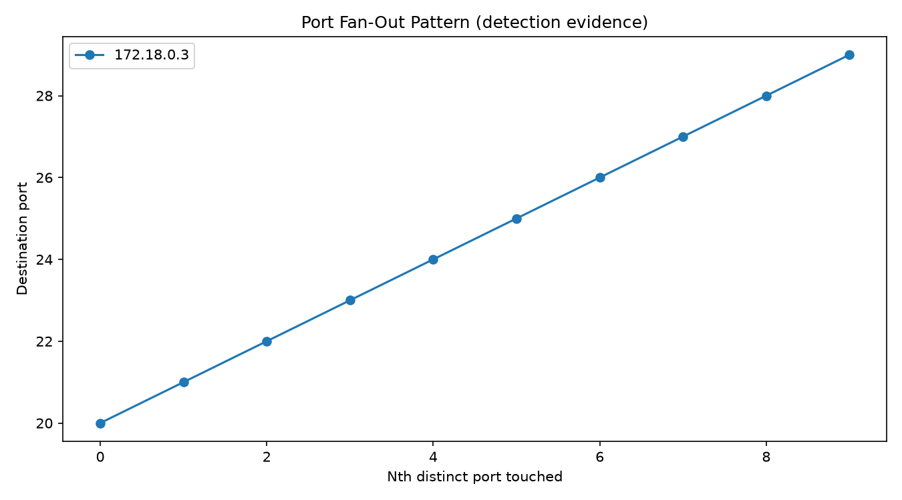
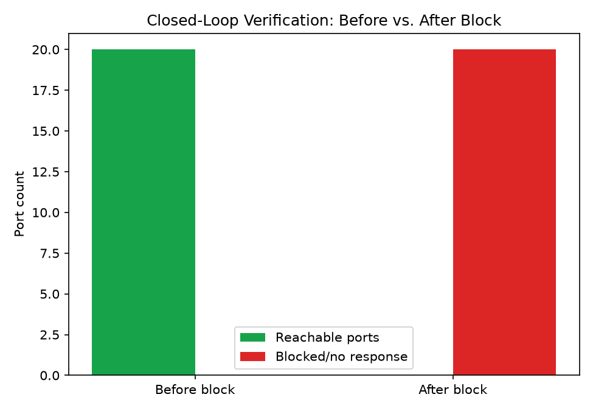
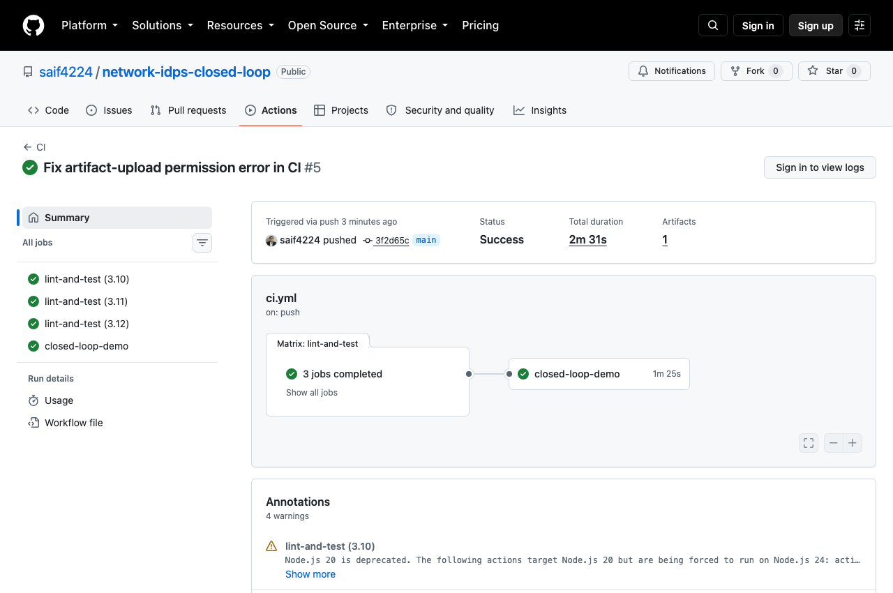

# Network IDPS Closed Loop

[](https://github.com/saif4224/network-idps-closed-loop/actions/workflows/ci.yml)
[](.github/workflows/ci.yml)
[](LICENSE)

A closed-loop intrusion detection and prevention system: real packet capture (`tshark`, Wireshark's
CLI engine), two independent real detectors (a deterministic fan-out check + a real **Suricata**
rule), an automated **iptables** block, and — the "closed loop" part — a second real attack burst
that **proves the block worked**, entirely from the pipeline's own packet evidence. No mocks, no
simulated traffic: three Docker containers, real TCP scans, a real firewall rule.

```
attacker ──SYN scan──► victim  ◄──tshark capture── sensor
                                                       │
                                          detect (custom + Suricata)
                                                       │
                                            iptables -j DROP (real)
                                                       │
attacker ──SYN scan (retry)──► victim  ◄──tshark capture── sensor
                                                       │
                                          verify: 0/20 ports now reachable
                                                       │
                                          closed_loop_confirmed: true
```

## Proof, not a claim

This is the actual output of a real run — 20 ports reachable before the block, 0 after:



## Why this exists

Most "IDS demo" projects stop at detection: parse a pcap, print an alert, done. That's the easy
half. The half that actually matters operationally is whether *the response works* — does the
firewall rule you just pushed actually stop the traffic, or does it just look right in a config
file? This pipeline treats that question as something to prove, not assume: it re-attacks after
blocking and checks its own packet capture for the answer.

## Quickstart

```bash
git clone https://github.com/saif4224/network-idps-closed-loop.git
cd network-idps-closed-loop
docker compose up --build
```

This is Docker-only by design — see [Architecture](#architecture) for why. `docker compose up`
builds three containers (an isolated attacker, a victim, and the sensor that does everything below)
and runs the full loop:

1. The **sensor** starts a real `tshark` capture on the shared network interface.
2. It tells the **attacker** to run a real TCP connect scan (20 ports) against the **victim**, then
   automatically repeat it ~20 seconds later.
3. It detects the scan two ways: a deterministic port fan-out check, and a real **Suricata** run
   against the same capture with a custom rule.
4. It applies a real `iptables -I INPUT -s <attacker_ip> -j DROP` — the attacker's actual IP,
   discovered from the detection, never hardcoded.
5. It captures the second (pre-scheduled) burst and checks: did the victim respond to *any* of the
   20 ports this time? If the answer is no — genuinely observed on the wire, not assumed —
   `closed_loop_confirmed: true`.

The sensor container exits `0` only if the loop closed successfully, so `docker compose up
--exit-code-from sensor` doubles as a pass/fail check (exactly what CI uses).

## Live mode (your own infrastructure)

```bash
python -m idps.cli --live --target 10.0.0.20 --attacker-url http://10.0.0.5:9000 \
    --ports 20-100 --interface eth0
```

Needs `tshark`, `suricata`, and `iptables` available where it runs, plus something implementing the
attacker control API's `/scan` contract (see `containers/attacker/controller.py`). **Only ever run
this against infrastructure you own and are explicitly authorized to test.**

## Sample output

`incident_report.json` (truncated):

```json
{
  "detections": [{ "detector": "port_scan_fanout", "src_ip": "172.18.0.3", "severity": "high",
                    "description": "172.18.0.3 touched 10 distinct ports within 5s..." }],
  "suricata_alerts": [{ "signature": "IDPS Possible Port Scan (SYN fan-out)", "src_ip": "172.18.0.3" }],
  "applied_rule": { "src_ip": "172.18.0.3", "action": "DROP", "rule_spec": "iptables -I INPUT -s 172.18.0.3 -j DROP" },
  "verification_before": { "ports_reachable": [20, 21, ..., 39], "ports_blocked": [] },
  "verification_after":  { "ports_reachable": [], "ports_blocked": [20, 21, ..., 39] },
  "closed_loop_confirmed": true
}
```

Evidence visuals, generated on every run:

| Port fan-out (why it was detected) | Before vs. after the block (proof it worked) |
|---|---|
|  |  |

## Architecture

See [`docs/architecture.md`](docs/architecture.md) for the full design, including a genuine snag
hit while building this: the first version had the sensor call the attacker's API twice, and the
second call always timed out — because blocking the attacker's IP also blocks its replies to the
sensor's own verification request. Fixed by having the attacker self-schedule both bursts from one
call, so the sensor never needs to reach the (now-blocked) attacker again. Short version:

| Container | Role |
|---|---|
| `victim` | The protected asset - a trivial Flask app, not exposed to the host |
| `attacker` | Control API that runs a real TCP connect scan on request, can self-schedule a repeat |
| `sensor` | This project's code - shares the victim's network namespace, so its capture sees real traffic and its `iptables` rules apply to the victim's real network stack |

**Why Docker-only, no offline fixture mode:** this author's other portfolio pipelines analyze files
(a pcap, a binary, a memory report) and can honestly demo that with a frozen fixture. This project's
subject is whether a live firewall rule changes live traffic - there's no meaningful way to fixture
that; it has to actually happen.

## Testing

```bash
pip install -r requirements-dev.txt   # plus: brew install wireshark suricata (macOS) or apt-get install tshark suricata (Linux)
pytest --cov=idps
ruff check .
```

Pure detection/verification/reporting logic is tested with hand-built packet fixtures - no tools
needed. Tests that exercise the real `tshark`/`suricata` binaries are skip-guarded
(`pytest.mark.skipif`) so the suite still runs cleanly without them installed, but runs for real
wherever they are. GitHub Actions installs both and runs everything for real, then builds and runs
the actual 3-container closed loop as its own CI job — see [`.github/workflows/ci.yml`](.github/workflows/ci.yml).



## Scope & safety

- **Every attack in this repo happens inside the isolated `docker-compose` network**, generated by
  the bundled attacker container against the bundled victim container. No traffic reaches the host
  or the internet by default.
- **`--live` mode must only ever target infrastructure you own and are explicitly authorized to
  test.** The pipeline detects, blocks, and verifies - it never constructs an exploit or does
  anything beyond TCP connect attempts and IDS-style packet inspection.
- The custom Suricata rule (`data/suricata_portscan.rules`) is real and minimal by design - see its
  header comment for why it doesn't depend on the full Emerging Threats ruleset.

## Tech stack

Python 3.10+ · `tshark` (Wireshark CLI - real packet capture/dissection) · Suricata (real IDS
engine) · `iptables` (real firewall enforcement) · Flask (demo sandbox apps) · `matplotlib`
(evidence visuals) · Docker Compose · GitHub Actions

## License

[MIT](LICENSE)
