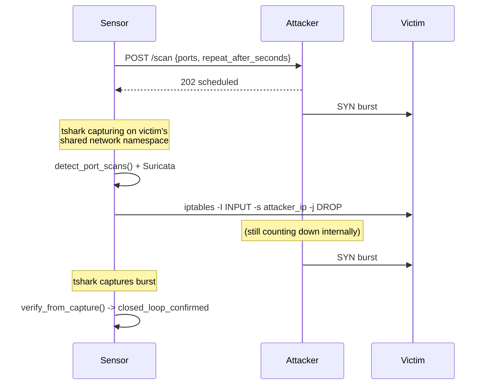

# Architecture

## Why a live 3-container sandbox, not fixtures

This author's other portfolio pipelines use offline fixtures because their subject is *analysis* -
parsing a file, checking a hash, matching a CVE - which is meaningfully the same whether the input
came from a live run or a frozen sample. This project's subject is different: whether a firewall
rule *actually changes what happens on the wire*. That can't be demonstrated with a fixture; it
requires a real block being tested against real, repeated traffic. So instead of a demo/live split,
this repo ships the smallest possible live network for that idea to run on and prove itself in.

## The container topology

| Container | Role |
|---|---|
| `victim` | The protected asset - a trivial Flask app. Not exposed to the host. |
| `attacker` | A control API (`POST /scan`) that runs a real TCP connect scan against the victim on request, and can self-schedule a second burst after a delay. |
| `sensor` | This project's code. Shares the victim's network namespace (`network_mode: service:victim`) - the mechanism that lets its `tshark` capture see the victim's real traffic and its `iptables` rules apply to the victim's real network stack. |

## Why the attacker self-schedules both bursts

The first build of this pipeline had the sensor call the attacker's `/scan` API twice - once to
trigger the burst that gets detected and blocked, once more afterward to verify the block. That
second call always timed out. The reason took a moment to see: once the sensor blocks the
attacker's IP, *every* inbound packet from that IP is dropped - including the attacker's HTTP
response to the sensor's own verification request, since the control API happens to live on the
same IP that's now blocked. The fix wasn't to weaken the block (e.g. scoping it to spare port 9000)
but to remove the need for a second round-trip entirely: one upfront call tells the attacker to
scan now and scan again automatically after a fixed delay, so the sensor only ever needs to manage
its own capture timing afterward, never talk to the (now-blocked) attacker again.

## Two independent detectors

- **`detect/port_scan_detector.py`** - a small, fully deterministic Python function (distinct
  destination ports touched by one source within a sliding window). This is the pipeline's actual
  trigger for blocking, because its behavior is completely under this repo's control.
- **`detect/suricata_client.py`** - orchestrates the real Suricata engine against the same capture,
  using a small custom rule (`data/suricata_portscan.rules`) rather than the full Emerging Threats
  ruleset, so its alerting is just as deterministic. Its alerts are captured as corroborating
  evidence in the report, not as the trigger - two independent engines agreeing is stronger
  evidence than either one alone.

## Verification is capture-based, not attacker-reported

`verify_from_capture()` doesn't ask the attacker whether its scan succeeded. It looks at the
sensor's own packet capture and asks: for each probed port, is there *any* packet from the victim
back to the attacker (a SYN-ACK for an open port, a RST for a closed one)? Before the block, every
probed port should show some response. After a working block, none should - not because the
attacker gave up, but because iptables drops its packets before the victim's TCP stack ever
generates a reply. `closed_loop_confirmed` in the report is only ever `true` when both halves of
that comparison hold.

## Scope note

Every phase of the attack in this repo happens entirely inside the isolated `docker-compose`
network, generated by the bundled `attacker` container against the bundled `victim` container - no
traffic ever reaches the host or the internet. `--live` mode lets you point the same pipeline at
infrastructure you configure, but the pipeline only ever detects, blocks, and verifies; it never
constructs an exploit or touches anything beyond TCP connect attempts and IDS-style packet
inspection.
